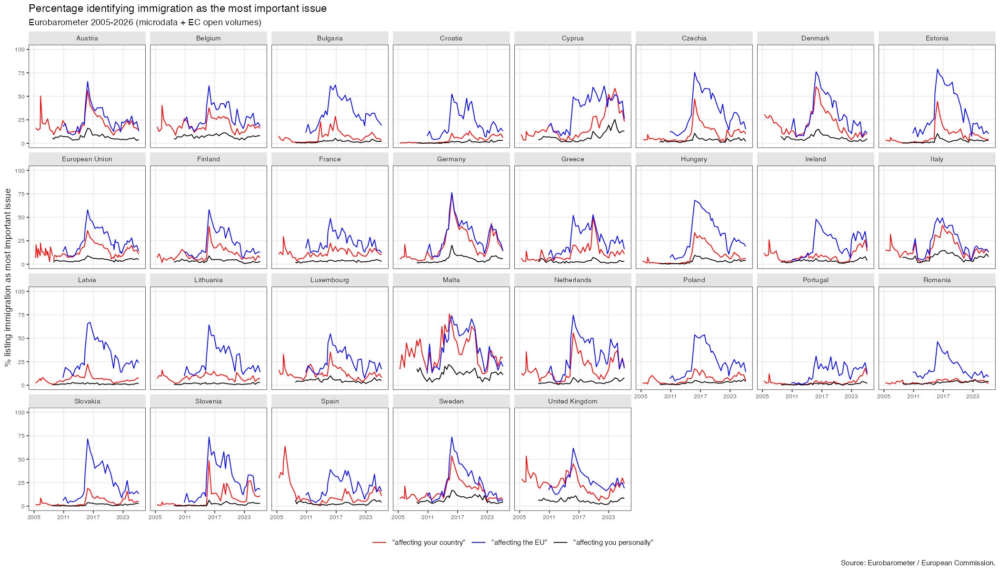

# Eurobarometer issue salience

An end-to-end, reproducible R pipeline that measures how salient different
**problems** are to Europeans — in three contexts (their **country**, the **EU**,
and **personally**) — and relates those perceptions to **real-world conditions**
(unemployment, inflation, asylum flows, GDP, crime, …).

It downloads the data, harmonises ~70 Eurobarometer waves (2003–2026) into a
respondent-level dataset, extracts each issue in all three question contexts,
pulls matching macro indicators from Eurostat, and produces (4) descriptive
small-multiples of problem perceptions by country over time and (5) correlation
figures linking perceptions to the real world.


*Percentage naming immigration the most important issue, by country, 2005–2026.
Red = facing your country, blue = facing the EU, black = facing you personally.*


## What it produces

| # | Deliverable | Stage |
|---|---|---|
| 1 | Download all Eurobarometer + Eurostat data | `00`, `03` |
| 2 | Process to **personal / national / EU** problem perceptions | `01`, `02` |
| 3 | Correlate perceptions with real-world variables | `03`, `04` |
| 4 | Descriptive graphs: perceptions by country (facet) × year (x-axis) | `05` |
| 5 | Correlation graphs: real-world variables vs perceptions | `06` |

Outputs land in `data/` (tidy tables: `salience_contexts.csv`, `correlations.csv`)
and `output/` (figures).

## Data sources & tiers

| Source | Access | Coverage | Used for |
|---|---|---|---|
| **GESIS** Eurobarometer microdata | Free account; **not redistributable** | 2003–2026, all issues × 3 contexts, individual level | full-history salience + the multilevel model |
| **European Commission** Standard EB result volumes ([data.europa.eu](https://data.europa.eu)) | Open, no login | latest rounds (EB 101–105, 2023–2026) | latest waves, appended after the microdata boundary |
| **Eurostat** (`eurostat` R package) | Open API | 2001–present | all real-world macro indicators |
| **Global Terrorism Database** + UK supplements | Manual download (optional) | terrorism deaths; UK unemployment/asylum | optional; pipeline skips gracefully if absent |

The three-context split over a long history only exists in the GESIS microdata, so
that is the primary Eurobarometer source; the open EC volumes extend each series to
the most recent wave. On the overlapping wave (EB 101.3) the two agree to
**r = 0.999, mean abs. diff 0.33 pp** — they are interchangeable.

> **The three contexts.** Eurobarometer asks the "most important issues" battery
> three times: *facing (your country)* (QA3), *facing you personally* (QA4), and
> *facing the EU* (QA5). Most analyses collapse these; this pipeline keeps them
> apart, which is the core feature.

## Setup

```r
# 1. Restore the pinned package environment
install.packages("renv"); renv::restore()

# 2. (Optional, for the full history) point at your GESIS microdata cache:
Sys.setenv(EB_DATA_ROOT = "/path/to/Eurobarometer_individual")  # holds ZA####.rds
#    To fetch microdata: register free at https://login.gesis.org, then run
#    R/download_gesis_microdata.R (uses the `gesisdata` package + your credentials).
```

No microdata? The pipeline still runs on the **EC-only tier** (open, no account) —
it just limits the three-context series to the recent EC waves.

## Running

```sh
Rscript run_all.R            # full pipeline (auto-detects microdata)
SKIP="03 04" Rscript run_all.R   # skip stages by number
```

Stages (each idempotent; reads/writes `data/` + `output/`):

```
00_download_eurobarometer.R   EC open volumes -> data/ec_salience.csv (+ microdata status)
01_build_micro.R              harmonise GESIS waves -> core_micro (respondent level)
02_build_contexts.R           issue × {country, EU, personal} -> data/salience_contexts.csv
03_build_macro.R              Eurostat (+optional GTD/UK)   -> data/core_macro.rds
04_correlate.R                salience ↔ macro -> data/correlations.csv
05_plot_descriptive.R         output/descriptive_<issue>.png
06_plot_correlations.R        output/correlation_overlay_*.png + correlation_summary.png
```

## Methods

- **Three-context extraction** (`R/context_extract.R`): per issue, a respondent
  "mentions" it in a context if any matching survey item is ticked (`pmax` over
  items — handles split-ballots and multi-item issues). Issues and their
  label-matching regexes live in `config.R` (`issue_specs`).
- **Correlation** (`04_correlate.R`), per issue↔macro pair in `config.R`
  (`ISSUE_MACRO`): (i) pooled within-country z-score correlation; (ii) panel
  fixed-effects (country dummies, cluster-robust SE) in levels and first
  differences; (iii) an individual-level multilevel logit (`glmer`) for
  unemployment salience.

## Repository layout

```
config.R              paths, issue specs, issue↔macro map, country set, EC keys
R/                    pure functions (harmonisation, context extraction, EC parser, theme, utils)
R/macro/              one Eurostat loader per indicator
00–06_*.R, run_all.R  the pipeline
data/reference/       small committed inputs (date corrections, EC snapshot)
output/               figures (a curated few committed)
```

## Caveats

- **GESIS microdata are not included** (licence). The repo is code-only; you
  download data at runtime.
- **Cyprus**: `CY-TCC` (the Turkish-Cypriot Community sample) is kept **separate**
  from `CY`, not merged — merging it halved Cyprus's salience on every issue.
- **Environment** salience combines "environment" + "climate change" (excludes
  standalone energy); a few waves bundle energy irreducibly into one item.
- Terrorism / UK series require the optional manual files; otherwise skipped.

Code: MIT. Data: see `LICENSE` and each provider's terms.
