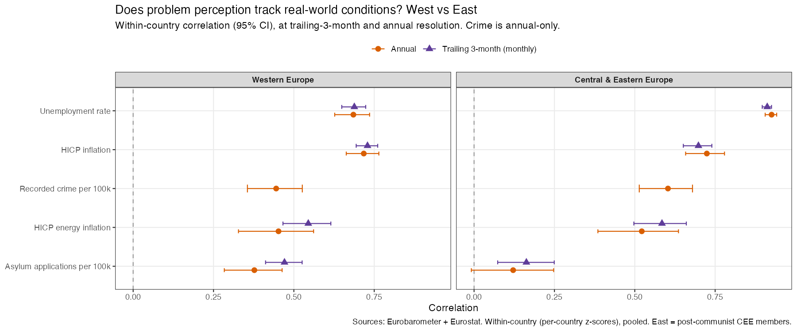
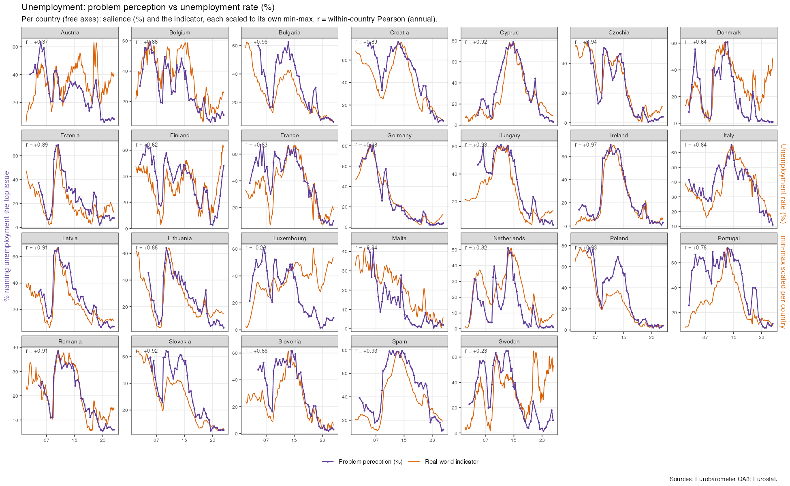

# How closely does problem perception track reality?

*Eurobarometer issue salience vs real-world conditions, 2002–2026. Reproducible from this repository (`run_all.R`).*

## Question

When a problem gets worse in the real world, do more people name it the most
important issue facing their country? We test five problems against the Eurostat
variable each should plausibly respond to:

| Perception | Real-world variable |
|---|---|
| Unemployment | Unemployment rate |
| Inflation / cost of living | HICP inflation |
| Energy | HICP energy inflation |
| Immigration | Asylum applications per 100k |
| Crime | Recorded crime per 100k (homicide + robbery + burglary) |

## Method

Salience is the survey-weighted share naming the issue (national context, QA3).
Correlations are **within country** (per-country z-scores, pooled, so they describe
over-time co-movement rather than cross-country level differences), at **two
resolutions**: each Eurobarometer wave matched to the **trailing 3-month average**
of the indicator, and **annual** means (crime is published only annually, so it has
no monthly version). The two agree closely — the figures below use the 3-month
resolution; the annual values are in `correlations.csv` and on the summary plot.
We report the within-country **correlation** (95% CI) and a panel fixed-effects slope. Time-series overlays
show salience (%) and the indicator **each min–max scaled to its own range, per
country** (free axes), so co-movement is visible in every country; each facet is
labelled with its r.

## Findings

| Perception ~ variable | Within-country correlation |
|---|---|
| Unemployment ~ unemployment rate | **0.78** |
| Inflation ~ HICP inflation | 0.72 |
| Energy ~ HICP energy inflation | 0.56 |
| Crime ~ recorded crime | 0.51 |
| Immigration ~ asylum applications | 0.35 |

**1. Economic problems track reality closely.** Unemployment salience moves almost
one-for-one with the unemployment rate (0.78) — the cleanest relationship in the
data, visible country by country in the overlay (the 2008–13 surge in Spain, Greece,
Portugal, Ireland). Inflation is close behind.

**2. Energy is the least robust.** Energy salience correlates with energy prices at
0.56, but the relationship is carried almost entirely by the **2022 energy-price
shock** — outside that episode there is little steady co-movement, so treat the
energy figure as one-episode-driven rather than a standing relationship.

**3. Immigration tracks asylum only loosely.** At ~0.33 it is the weakest link of
the five. Immigration salience is driven by crisis episodes (2015–16) and by national
politics more than by the asylum numbers themselves — concern often stays high after
flows recede, and rises for reasons unrelated to local arrivals.

**4. Crime tracks moderately** (≈0.52, robust across both measures), though crime
statistics are annual and sparser than the monthly economic series.

**5. West vs East diverge only on immigration.** Splitting the sample, economic
problems track reality *as well or better* in Central & Eastern Europe than in the
West (unemployment 0.91 vs 0.69; crime 0.60 vs 0.44; inflation 0.70 vs 0.73). The
single exception is **immigration**: 0.47 in the West but only **0.16** in the East
(CI nearly touching zero) — Eastern concern about immigration is largely decoupled
from actual asylum arrivals and driven by politics, a pattern absent for the
economic issues.

## Takeaway

Problem perception is **tightly coupled to economic conditions** (unemployment,
inflation) and **loosely coupled to immigration**. Unemployment and crime are steady
relationships; energy is a single-episode (2022) artefact. "People worry about what's
happening" holds strongly for the economy and weakly for immigration.

## Caveats

- Eurobarometer runs ~2–3 waves/year, so the perception side caps temporal resolution.
- Correlations are **descriptive co-movement, not causal** — measures are collinear
  and there is no identification strategy.
- Crime data is annual and covers fewer country-years than the economic series.
- National-context salience only; microdata + EC open volumes spliced at 2024
  (validated overlap r = 0.999); Cyprus excludes the Turkish-Cypriot Community sample.
- **Data quality:** EB 65.3 (ZA4507, May 2006) is excluded — it used a non-standard
  multi-select "important national issues" question (respondents picked ~3 issues vs
  the standard 2), which inflated *every* issue's salience ~2–3× and produced a
  spurious one-wave spike. It is the only such wave (all others verified consistent).
