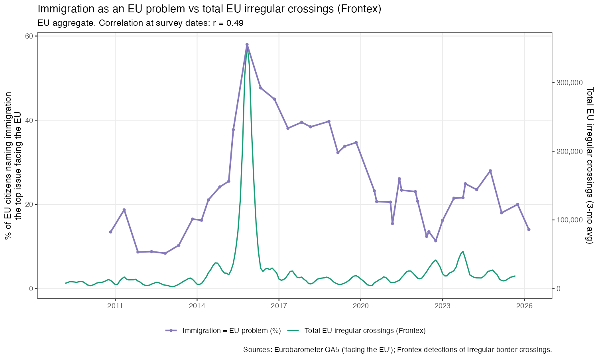
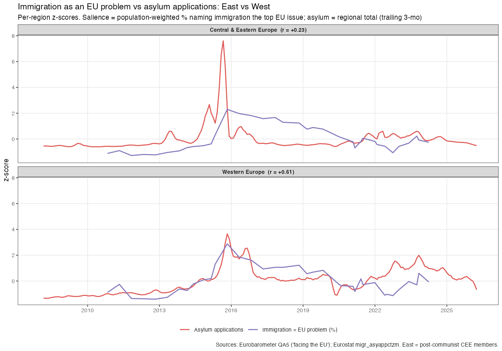
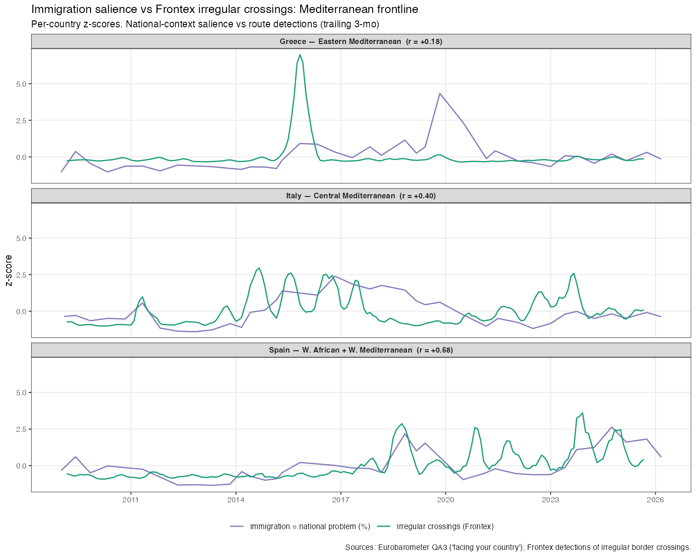
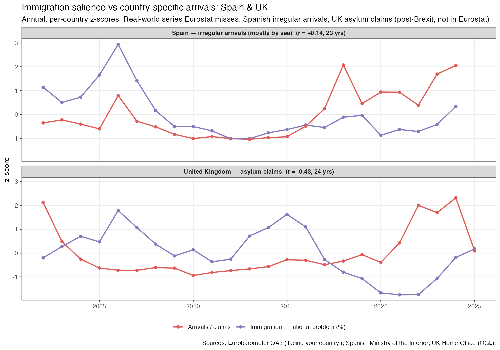
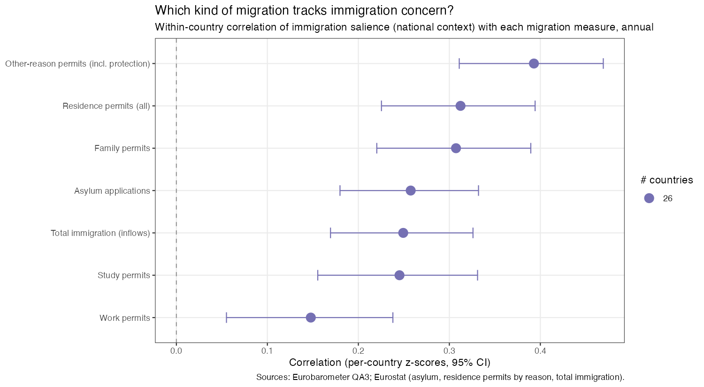

# Does immigration get more salient when migration rises?

*An analysis of European problem perceptions against real-world migration, 2002–2026.*
*Draft — figures and numbers are reproducible from this repository (stages `02`–`09`).*

## Question

When more migrants arrive, do Europeans become more likely to name immigration as
the most important problem facing their country or the EU? And if so, **which kind**
of migration moves perceptions — asylum seekers, boat arrivals, labour migrants,
families, refugees?

## Data

- **Perceptions** — Eurobarometer "most important issues" battery, asked in three
  contexts: facing *your country* (QA3), *you personally* (QA4), and *the EU* (QA5).
  Harmonised from GESIS microdata (2002–2024, ~70 waves, 1.5M respondents) and
  extended with the European Commission's open result volumes (2024–Spring 2026).
- **Real-world migration** — Eurostat (first-time asylum applications; residence
  permits by reason: work / family / study / other; total immigration inflows;
  temporary protection), Frontex detections of irregular border crossings by route,
  the Spanish Interior Ministry (irregular arrivals), and the UK Home Office
  (asylum claims; the UK is absent from Eurostat post-Brexit).

## Method

Salience is the survey-weighted share naming immigration. Real-world series are
smoothed with a trailing 3-month mean and aligned to survey fieldwork months.
Correlations are within-country (per-country z-scores, pooled) or, for EU-level
comparisons, on the pooled EU aggregate. **All figures below are correlations, not
causal estimates**, and the absolute values are method-dependent (monthly vs annual,
EU-pooled vs within-country), so compare *within* a panel, not across.

## Findings

### 1. Perception tracks arrivals during crises, then decouples

At the EU level, concern about immigration as an *EU* problem moved almost
identically with arrivals during the 2015–16 crisis — both peaked together — but
the two then came apart. Irregular crossings (Frontex, r ≈ 0.49) track perception
somewhat better than asylum applications (r ≈ 0.39), because Frontex captures the
sheer scale of the 2015 spike that drove the crisis narrative.

After 2016 the lines diverge: concern stayed elevated while flows fell, and the
2022–24 rise in arrivals did **not** revive immigration as a *perceived* EU problem
(inflation and the war dominated the agenda). A single correlation therefore
understates the crisis co-movement and overstates the calmer years.

### 2. East and West differ sharply

Splitting the EU, **Western Europe's** concern tracks the arrivals it actually
receives (r ≈ 0.61), while **Central & Eastern Europe** is largely decoupled
(r ≈ 0.23): a brief 2015 transit spike gave way to *persistent* concern through
2016–19 unrelated to local arrivals — salience driven by politics, not flows.

### 3. Frontline countries: Spain tracks tightly, Greece barely

Among Mediterranean frontline states, Spain's concern follows its route crossings
closely (r ≈ 0.68 since 2009), Italy moderately (r ≈ 0.40), and Greece hardly at all
(r ≈ 0.18) — Greece had the largest 2015 crossings of any route with almost no
salience response, as the debt crisis owned the agenda.

Spain is instructive on *time horizon*: extending its series back to 2002 with
Interior-Ministry data drops the correlation to 0.27, because early-2000s Spanish
concern tracked the **regular-migration boom** (millions of labour migrants), not
boats. The tight boat–salience link is a modern (post-2009) phenomenon.

### 4. The UK: concern rose when asylum was *low*

UK immigration concern peaked in 2006 and 2014–16 — the Brexit / EU-free-movement
era — when asylum claims were comparatively low; claims then surged in 2022–24
(small boats) while concern only partly recovered. The full-period correlation is
**negative** (r ≈ −0.43): UK concern was about EU free movement, not asylum.

### 5. Which kind of migration? Humanitarian and family, not labour

Comparing migration *types* as correlates of immigration concern (within-country,
annual, 26 countries): concern tracks **humanitarian and family** migration more
than **labour** migration. Work permits — numerically the *largest* legal-migration
category — correlate **least** (r ≈ 0.15); the humanitarian/"other-reason" permit
bucket correlates most (r ≈ 0.39). Asylum applications sit in the middle (r ≈ 0.26).

Caveats matter here: the confidence intervals overlap substantially (treat it as a
gradient, not a strict ranking); these are *marginal* correlations of mutually
correlated measures, not independent effects; and the top bar is Eurostat's residual
"other reasons" permit category (international protection **plus** miscellaneous),
not pure refugees. Asylum *applications* (a timely front-end request) and protection
*permits* (a lagged back-end grant) are different constructs measured ~1 year apart.

### 6. The Ukraine exception: the biggest inflow that wasn't a "problem"

Adding **temporary protection** (the Ukraine displacement — the largest inflow in EU
history) to the migration measure **worsens** the correlation with immigration
concern rather than improving it:

| vs immigration salience | EU level | Pooled national |
|---|---|---|
| Asylum applications alone | 0.58 | 0.44 |
| Asylum + temporary protection | 0.15 | 0.25 |
| Temporary protection *alone* | −0.24 | — |

Temporary protection is migration by volume, but it was framed as humanitarian and
sympathetic — months and countries with *more* Ukrainian arrivals had, if anything,
*lower* immigration-as-a-problem salience. It is therefore **excluded** from the
migration measures. (Numbers here are from a focused trailing-3-month test; the
asylum-alone figure differs from §1 because of the comparison window.)

## Synthesis

Problem perception is **loosely and selectively coupled** to real-world migration.
It responds to *visible, crisis, irregular, and protection-seeking* migration
(the 2015 crossings, boats to Spain, asylum) and barely to *routine* migration that
is numerically larger (labour permits, Ukrainian temporary protection). The link is
strong during acute crises and weak otherwise, and it is mediated by national
politics and the wider agenda — hence the East/West gap, the UK's free-movement
framing, and Greece's debt-crisis crowding-out. **Volume is not salience; the type
and framing of migration matter more than the count.**

## Limitations

- Eurobarometer runs ~2–3 waves/year, so the **perception side caps the resolution** —
  finer-than-quarterly migration data buys precise alignment, not monthly correlation.
- Correlations are **modest and CIs overlap**; rankings are suggestive.
- **Marginal, not causal** — measures are collinear; no identification strategy.
- Measures differ in **stage** (applications vs permits) and **resolution** (monthly
  asylum/crossings vs annual permits/immigration).
- Microdata and EC open volumes are spliced at 2024 (validated overlap r = 0.999);
  Cyprus excludes the separately-sampled Turkish-Cypriot Community; the UK is
  surveyed as a non-member third country post-Brexit.

## Reproducibility

All series and figures are produced by the pipeline in this repository
(`run_all.R`, stages `02`–`09`); see the [README](../README.md) for data sources
and how to run it.
